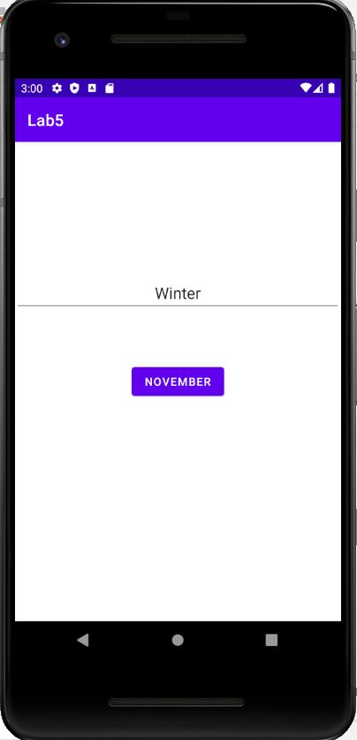
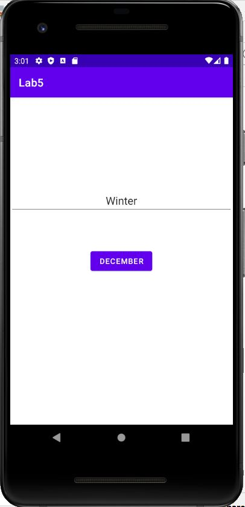

# Лабораторная работа №5. UI Tests.

## Цели
1. Ознакомиться с принципами и получить практические навыки разработки UI тестов для Android приложений.

## Задачи
Предполагается, что все задачи решаются с помощью Instrumentation (Android) tests и Espresso Framework, если иное явно не указано в тексте задания.

### Задача 1. Простейший UI тест
Необходимо ознакомиться с Espresso Framework: https://developer.android.com/training/testing/espresso и разработать приложение, в котором есть одна кнопка (`Button`) и одно текстовое поле (`EditText`). При (первом) нажатии на кнопку текст на кнопке должен меняться.

Нужно написать Espresso тест, который проверяет, что при повороте экрана содержимое текстового поля (каким бы оно ни было) сохраняется, а надпись на кнопке сбрасывается в исходное состояние. 

Листинг MainActivity:

        class MainActivity : AppCompatActivity() {
            override fun onCreate(savedInstanceState: Bundle?) {
                super.onCreate(savedInstanceState)

                val binding = ActivityMainBinding.inflate(layoutInflater)
                binding.changeButton.setOnClickListener {
                    binding.changeButton.text = getString(R.string.december)
                }
                setContentView(binding.root)
            }
        }

Листинг activity_main.xml:

        <?xml version="1.0" encoding="utf-8"?>
        <androidx.constraintlayout.widget.ConstraintLayout xmlns:android="http://schemas.android.com/apk/res/android"
            xmlns:app="http://schemas.android.com/apk/res-auto"
            android:layout_width="match_parent"
            android:layout_height="match_parent">

            <Button
                android:id="@+id/changeButton"
                android:layout_width="wrap_content"
                android:layout_height="wrap_content"
                android:text="@string/november"
                app:layout_constraintBottom_toBottomOf="parent"
                app:layout_constraintEnd_toEndOf="parent"
                app:layout_constraintStart_toStartOf="parent"
                app:layout_constraintTop_toTopOf="parent" />

            <EditText
                android:id="@+id/editText"
                android:layout_width="match_parent"
                android:layout_height="wrap_content"
                android:textSize="20sp"
                android:text="@string/winter"
                android:gravity="center"
                app:layout_constraintVertical_bias="0.3"
                app:layout_constraintBottom_toBottomOf="parent"
                app:layout_constraintEnd_toEndOf="parent"
                app:layout_constraintStart_toStartOf="parent"
                app:layout_constraintTop_toTopOf="parent"/>
        </androidx.constraintlayout.widget.ConstraintLayout>

Листинг strings.xml:

        <resources>
            <string name="app_name">Lab5</string>
            <string name="november">November</string>
            <string name="december">December</string>
            <string name="winter">Winter</string>
        </resources>

При запуске приложения видим следующее:

После нажатия на кнопку:

Листинг MainActivityTest:

        @LargeTest
        @RunWith(AndroidJUnit4::class)
        class MainActivityTest {

            @get:Rule
            val activityTestRule = ActivityScenarioRule(MainActivity::class.java)

            @Test
            fun mainActivityTest() {
                val changeB = onView(withId(R.id.changeButton))
                val editT = onView(withId(R.id.editText))

                editT.check(ViewAssertions.matches(withText("Winter")))
                changeB.check(ViewAssertions.matches(withText("November")))
                changeB.perform(click())
                changeB.check(ViewAssertions.matches(withText("December")))

                activityTestRule.scenario.onActivity{
                    it.requestedOrientation = ActivityInfo.SCREEN_ORIENTATION_LANDSCAPE
                }

                editT.check(ViewAssertions.matches(withText("Winter")))
                changeB.check(ViewAssertions.matches(withText("November")))
            }
        }

В тесте запускаем наше приложение с помощью правила, затем находим кнопку и поле editText. До каких-либо манипуляций в editText находится "Winter", а в текстовом поле кнопки: "November". После нажатия на кнопку её текст меняется на "December". Попробуем повернуть экран. Проверяем, что значение editText не изменилось, так как это View имеет собственную onSaveInstanceState реализацию, а значение текстового поля кнопки сбросилось до "November". 
Тест пройден успешно, приложение ведёт себя так, как от него ожидают.
Изначально попыталась потыкаться в Record Espresso Test: функция рабочая, но генерирует много лишнего да ещё и устаревшего кода. Ручками всё почистила и заменила библиотеку. Без неё было бы быстрее, но теперь я знаю, что такая вещь существует 👍

### Задача 2. Тестирование навигации.
Необходимо взять приложение из Лаб №3 о навигации (любое из решений) и написать UI тесты, проверяющие навигацию между 4-мя исходными Activity/Fragment (1-2-3-About). В отчете описать, что проверяет каждый тест.

Буду тестировать реализацию с фрагментами.

Листинг MainActivityTest:

        class MainActivityTest {

            @get:Rule
            val activityTestRule = ActivityScenarioRule(MainActivity::class.java)

            @Test
            fun startTest() { ... }

            @Test
            fun backstackTest() { ... }

            private fun openBottomNavigation() { ... }

            private fun isFirst() { ... }

            private fun isSecond() { ... }

            private fun isThird() { ... }

        }

Тест startTest() проверяет переходы между фрагментами:

    @Test
    fun startTest() {
        isFirst()
        onView(withId(R.id.bnGoTo2)).perform(click())
        isSecond()

        activityTestRule.scenario.onActivity {
            it.requestedOrientation = ActivityInfo.SCREEN_ORIENTATION_LANDSCAPE
        }
        Thread.sleep(1000)
        isSecond()

        onView(withId(R.id.bnGoTo1)).perform(click())
        isFirst()
        onView(withId(R.id.bnGoTo2)).perform(click())
        isSecond()
        onView(withId(R.id.bottomNav)).perform(click())
        openBottomNavigation()
        pressBack()
        onView(withId(R.id.bnGoTo3)).perform(click())
        isThird()
        onView(withId(R.id.bnGoTo2)).perform(click())
        isSecond()
    }

Реализация методов openBottomNavigation(), isFirst(), isSecond() и isThird() будет представлена ниже, по существу они показывают, что мы действительно находимся в том фрагменте, в котором рассчитываем быть. Попробуем повернуть экран. Без строчки Thread.sleep(1000) тест вылетал с ошибкой, так как Espresso плохо работает с анимацией из-за задержки визуального состояния, которую она создаёт. Можно было бы отключить её в параметрах разработчика, но было проще отправить поток спать 👉👈. В итоге тест прошёл успешно - поведение приложения соответствует ожидаемому.

Листинг openBottomNavigation:

        private fun openBottomNavigation() {
                onView(withId(R.id.bnGoTo1)).check((doesNotExist()))
                onView(withId(R.id.bnGoTo2)).check(doesNotExist())
                onView(withId(R.id.bnGoTo3)).check(doesNotExist())
                onView(withId(R.id.textView)).check(matches(withText("Something about activity")))
            }

Листинг isFirst:

        private fun isFirst() {
                onView(withId(R.id.bnGoTo1)).check((doesNotExist()))
                onView(withId(R.id.bnGoTo2)).check(matches(isDisplayed()))
                onView(withId(R.id.bnGoTo3)).check(doesNotExist())
                onView(withId(R.id.bottomNav)).check(matches(isDisplayed()))
            }
            
Листинг isSecond:

        private fun isSecond() {
                onView(withId(R.id.bnGoTo1)).check((matches(isDisplayed())))
                onView(withId(R.id.bnGoTo2)).check(doesNotExist())
                onView(withId(R.id.bnGoTo3)).check(matches(isDisplayed()))
                onView(withId(R.id.bottomNav)).check(matches(isDisplayed()))
            }

Листинг isThird:

         private fun isThird() {
                onView(withId(R.id.bnGoTo1)).check((matches(isDisplayed())))
                onView(withId(R.id.bnGoTo2)).check(matches(isDisplayed()))
                onView(withId(R.id.bnGoTo3)).check(doesNotExist())
                onView(withId(R.id.bottomNav)).check(matches(isDisplayed()))
            }

Реализация методов довольно простая: просто проверяем, что в данный момент находится на экране.

Теперь будет проверять глубину backstack:

     @Test
    fun backstackTest() {
        isFirst()
        onView(withId(R.id.bnGoTo2)).perform(click())
        onView(withId(R.id.bnGoTo3)).perform(click())
        isThird()
        pressBack()
        pressBack()
        isFirst()

        onView(withId(R.id.bnGoTo2)).perform(click())
        onView(withId(R.id.bnGoTo1)).perform(click())

        isFirst()

        activityTestRule.scenario.onActivity {
            it.requestedOrientation = ActivityInfo.SCREEN_ORIENTATION_LANDSCAPE
        }
        Thread.sleep(1000)

        isFirst()

        onView(withId(R.id.bnGoTo2)).perform(click())
        onView(withId(R.id.bnGoTo1)).perform(click())
        pressBackUnconditionally()
    }
    
Мысль проста - перемещаемся по фрагментам, возвращаемся назад и проверяем, что мы находимся там, где должны. При попытке вызвать pressBack() из корневой Activity тест улетает в бесконечность, пока не вылетает с исключением NoActivityResumedException. Почитав документацию, узнала, что существует метод, аналогичный pressBack(), но не вызывающий исключений при попытке выхода из приложения: pressBackUnconditional(). Также отправляем поток на тихий час после поворота экрана. По итогу тест пройден успешно.

### Выводы
Espresso тесты довольно удобны при тестированни приложений. По крайней мере, они удобнее ручной проверки, однако, они выполняются довольно долго и плохо работают с анимацией. Основные компоненты Espresso: 
       * ViewMatchers — методы, позволяющие найти объект в текущей иерархии представлений;
       * ViewAssertions — методы, позволяющие проверить состояние объекта и подтвердить, что состояние соответствует критериям;
       * ViewActions —  методы, позволяющие выполнять различные действия с объектами.      
